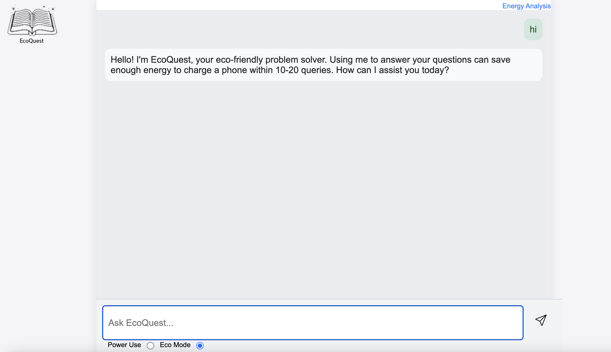
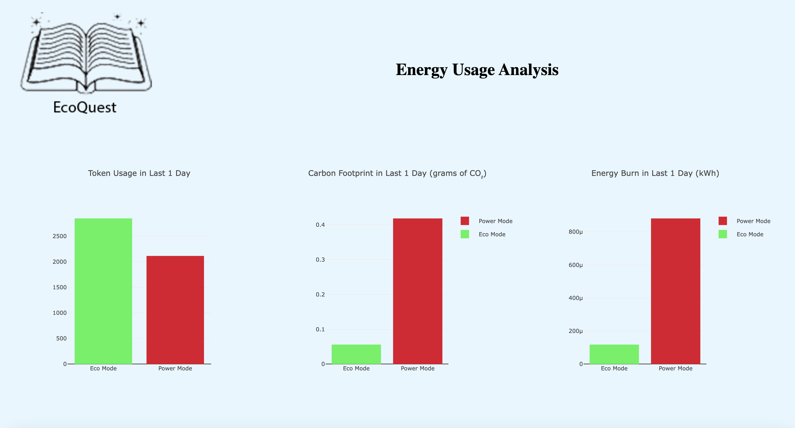
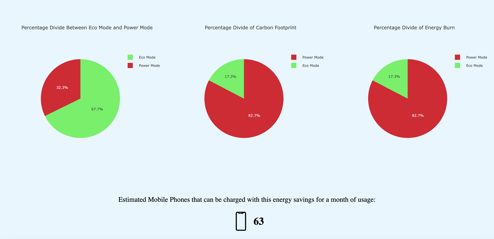
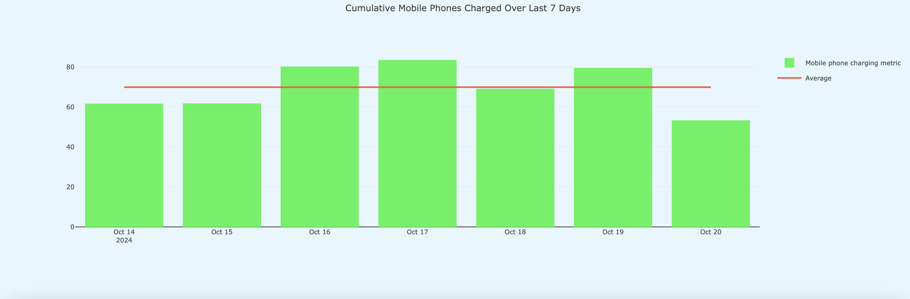

# EcoQuest

EcoQuest is a web application designed to provide insights into energy usage and savings while using LLMs. It features a chat interface that interacts with local LLMs powered by Ollama and OpenAI to answer queries related to energy efficiency. You can chat in eco-mode which uses the local LLM to save energy and costs. You can switch to power mode at which point it shifts to openAI to provide answers. the interface is as follows



## Features

- Chat interface to interact with OpenAI
- Energy usage analysis
- Visualization of energy data







## Project Structure

## Installation

1. Clone the repository:
    ```sh
    git clone https://github.com/yourusername/EcoQuest.git
    cd EcoQuest
    ```

2. Create and activate a virtual environment:
    ```sh
    python -m venv eq_env
    source eq_env/bin/activate  # On Windows use `eq_env\Scripts\activate`
    ```

3. Install the dependencies:
    ```sh
    pip install -r requirements.txt
    ```

4. Set up environment variables:
    Create a `.env` file in the root directory and add your OpenAI API key:
    ```env
    OPENAI_API_KEY=your_openai_api_key
    ```

## Usage

1. Run the application:
    ```sh
    uvicorn main:app --reload
    ```

2. Open your browser and navigate to `http://127.0.0.1:8000` to access the chat interface.

## Endpoints

- `/` - Main chat interface
- `/analysis` - Energy analysis page
- `/analysis-data` - API endpoint to get analysis data
- `/stream` - API endpoint to stream chat responses

## License

This project is licensed under the MIT License.